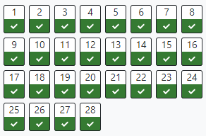

# OOP
A repo for all of my solved coding problems for Object-Oriented Programming at FCSE.  

**Exercises** - contains all the solutions to the problems on courses.finki.ukim.mk.  
**Labs** - contains all the problems that we have to solve in class and present.  
**Exams** - contains all the *harder* problems that I had on the exams.  

Most of the coding problems and excercises can be found on **courses.finki.ukim.mk**.  

[OOP Web Version](https://andrejstojkovic.github.io/OOP/)

## Status

### Kolokvium 1

### Kolokvium 2

### Exercises - SEIS

